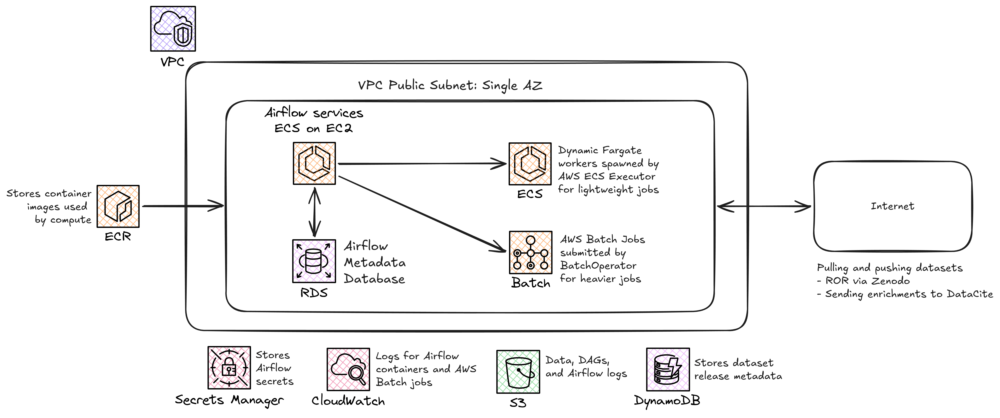
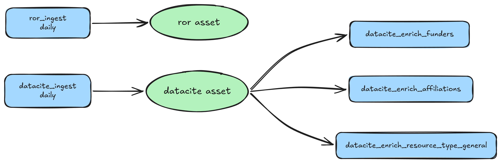
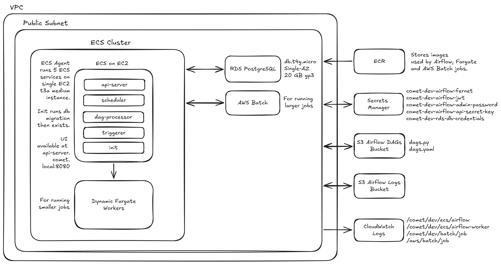
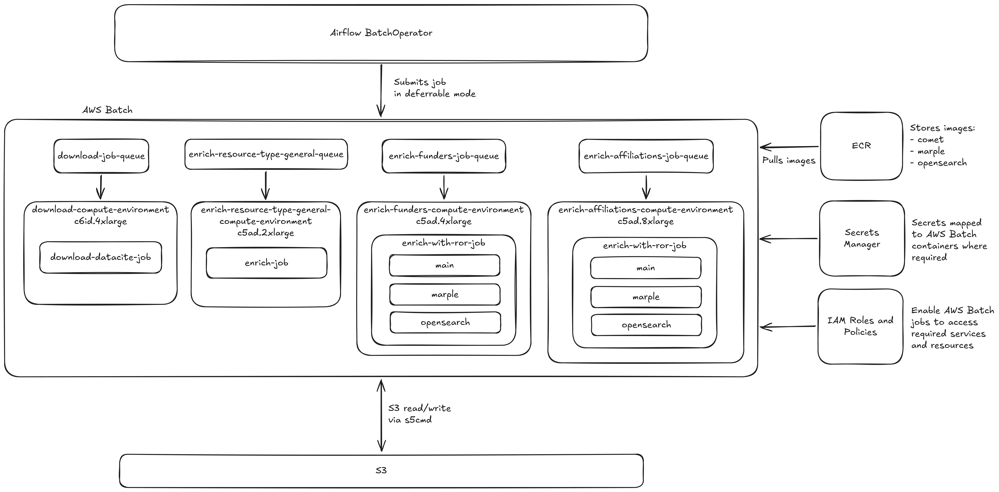
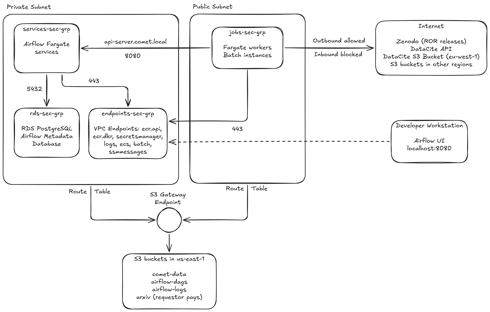

# Architecture

COMET runs data processing workflows that download and enrich external scholarly datasets such as [DataCite](https://datacite.org), [ROR](https://ror.org), and [arXiv](https://arxiv.org). [Apache Airflow 3](https://airflow.apache.org) provides the workflow orchestration layer, while ECS Fargate and AWS Batch provide the compute for processing tasks.

Everything is defined in CloudFormation and deployed with [Sceptre](https://docs.sceptre-project.org/) into a single availability zone. The Airflow services and the metadata database run in a private subnet; the Fargate workers, Batch instances, and the dev instance run in a public subnet because they download external data. See [setup.md](setup.md) for how to deploy.

## Data pipelines

Two ingest DAGs run daily. Each checks the upstream source for a release newer than the last one recorded in the `comet-<env>-dataset-releases` DynamoDB table, downloads it to `s3://<data-bucket>/{dag_id}/{run_id}/`, records the release, and publishes an Airflow Asset. The three DataCite enrichment DAGs are scheduled on the DataCite asset, so they run whenever a new DataCite snapshot is ingested.

Heavier processing runs as AWS Batch jobs. The general pattern is to store input and output data in S3: each job downloads the data it needs to local NVMe disk, processes it, uploads the results back to S3, and exits. [s5cmd](https://github.com/peak/s5cmd) is used for the transfers because it is significantly faster than the AWS CLI for large transfers and workloads involving many files. Each job writes to an S3 path that includes the Airflow run ID, and deletes anything already at that path before it starts, so jobs can be re-run safely and don't rely on local state or a specific instance.

Each DAG is created by a factory function in the `comet` package. The DAGs bucket holds a small `dags.py` entry point and a `dags.yaml` file with one entry per DAG instance; a new DAG is added by appending an entry to the YAML file (see [dags.md](dags.md)).

Enrichment rules and provenance are maintained in `comet-enrich`, stored under the data bucket's `enrichment-configs/` prefix, and downloaded by Batch jobs at runtime. The infrastructure deployment does not manage these objects.

The arXiv TeX extraction pipeline has not been moved to Airflow yet; it is run manually on the dev EC2 instance (see [arxiv-pipeline.md](arxiv-pipeline.md)). The dev instance is managed by an Auto Scaling Group that defaults to zero instances and is started on demand; a scheduled action shuts it down nightly (see [setup.md](setup.md)).

## Apache Airflow

The Airflow services run as four independent ECS Fargate services, each its own task definition and service. Running them separately lets ECS restart a failed component without affecting the others. The components do not call each other; they coordinate through the metadata database.

The four services and the init task:

* `init`: a one-off Fargate task that runs `airflow db migrate` and `airflow fab-db migrate`, then exits. If the Fernet key is set to `NEW,OLD` for rotation, it also runs `airflow rotate-fernet-key` to re-encrypt stored connections and variables. A `before_launch` hook on the services stack runs this task and waits for it to succeed before deploying the services, so the schema is always migrated first.
* `api-server`: the UI and the Task Execution API that workers use.
* `scheduler`: triggers DAG runs and dispatches tasks.
* `dag-processor`: parses the DAG bundle from the DAGs bucket.
* `triggerer`: runs deferrable operators.

The scheduler uses the [AWS ECS Executor](https://airflow.apache.org/docs/apache-airflow-providers-amazon/stable/executors/ecs-executor.html) to run each Airflow task as a one-off Fargate task that exits when the task finishes. Workers are not given any secrets; they read connections, variables, and state through the Task Execution API. Batch jobs are submitted with the `BatchOperator` in deferrable mode, which lets Airflow submit a job and wait for it to complete without using a worker while the job runs.

The deployment also relies on several supporting AWS services:

* RDS PostgreSQL stores the Airflow metadata database.
* S3 stores the DAG bundle and task logs.
* Secrets Manager stores the Fernet key, database credentials, admin password, the JWT secret for the Task Execution API, and the API server session signing key.
* CloudWatch stores container logs.

Inbound traffic from the internet is blocked; the UI is accessed by port-forwarding into the api-server task with ECS Exec (see [setup.md](setup.md)).

## AWS Batch

Fargate supports up to 16 vCPU, 120 GiB of memory, and 200 GiB of ephemeral disk, which is not enough for the heavier enrichment jobs. AWS Batch allows larger compute resources to be used when required, whilst only paying for that compute while jobs are running.

There is one job queue per compute environment, and each compute environment uses a single instance type, sized so that one job nearly fills the instance. This stops Batch from scheduling two jobs onto the same instance. A launch template mounts the instance NVMe disks at `/data` (RAID0 when there are two disks).

Three job definitions:

* `download-datacite`: copies the DataCite snapshot to S3. It has its own execution role because ECS injects the DataCite credentials from Secrets Manager.
* `enrich`: generic single-container CPU enrichment, such as resource type reclassification.
* `enrich-with-ror`: a [single-node multi-container job](https://docs.aws.amazon.com/batch/latest/userguide/create-job-definition-single-node-multi-container.html) used by the funders and affiliations enrichments. It runs an OpenSearch container, a [Marple](https://gitlab.com/crossref/labs/marple) container that seeds the ROR index, and the main container, which waits until Marple reports ready before running the enrichment binary.

The `BatchOperator` sets the command and resource sizes for each run, so the job definitions don't need to be changed for each use case.

## Networking and security

The VPC has a public subnet with an internet gateway for the Airflow Fargate jobs and the AWS Batch jobs. The VPC also has a private subnet for the Airflow services and the RDS metadata database. The private subnet has no route to the internet: the services reach the AWS APIs they need through VPC interface endpoints, and reach S3 through the free gateway endpoint. Whilst the Airflow services and the RDS metadata database have public access disabled in CloudFormation, the private subnet acts as a second layer of defense.  Everything is deployed into a single availability zone. A second private subnet in another AZ exists only to satisfy the RDS two-AZ requirement; nothing runs in it.

There are four security groups, one for each group of resources. None of them accept traffic from outside the VPC; the UI and shell access go through SSM, which only needs outbound access.

* `services` contains the four Airflow Fargate services, the only resources with access to the Airflow secrets: the database credentials, Fernet key, JWT secret, API session signing key, and admin password. The only inbound rules are port 8080 from `jobs` for the Task Execution API, and port 8080 from itself so the components can reach the api-server. The services have no public IPs; they sit in the private subnet and reach AWS only through the VPC endpoints.
* `jobs` contains the Fargate workers, Batch instances, and the dev instance, and has no inbound rules. They all have public IPs because they download external data.
* `endpoints` accepts 443 from `services` and `jobs`.
* `rds` accepts 5432 from `services` only. Workers and Batch jobs cannot connect to the database; they read and write state through the api-server.

The VPC endpoints are: S3 (a free gateway endpoint, also used for ECR image layers), ECR (image pulls), Secrets Manager, CloudWatch Logs, ECS (used by the scheduler to launch Fargate workers), Batch (used by the triggerer to poll job status), and SSM messages (used by ECS Exec for the UI port-forward).

## Container images

| Image           | Built from           | Runs on                                                                  |
|-----------------|----------------------|--------------------------------------------------------------------------|
| `comet`         | `Dockerfile`         | Dev EC2 instance (arXiv pipeline; includes arxiv-tex-extract and DuckDB) |
| `comet-batch`   | `Dockerfile.batch`   | AWS Batch jobs (comet package + `comet-enrich`)                          |
| `comet-marple`  | `Dockerfile.marple`  | The Marple container in enrich-with-ror jobs                             |
| `comet-airflow` | `Dockerfile.airflow` | Airflow services and Fargate workers                                     |

Images are stored in ECR. The Airflow image is pinned by its sha256 digest, which is stored in SSM. Pushing a new image changes the task definition, which makes ECS redeploy the services.

## Monitoring and cost alerts

### Alarms

* CloudWatch Logs: alarm when log ingestion exceeds the per-five-minute byte threshold in at least two of the last four periods.
* S3: alarm when combined storage across the three project buckets exceeds the configured threshold.
* RDS: forward low-storage and configuration-change events to the monitoring SNS topic.
* EC2 and Fargate worker tasks:
  * Alarm when tasks exceeds the age threshold for two consecutive five-minute periods.
  * Alarm when task launches in the previous ten minutes exceed the threshold for two consecutive five-minute periods.
  * Alarm when task launches in the previous ten minutes exceed the threshold for two consecutive five-minute periods.
* Airflow ECS services:
  * Alarm when fewer service tasks are running than expected for two consecutive five-minute periods.
  * Alarm when one or more service tasks report an essential-container failure for two consecutive five-minute periods.
* AWS Lambda: alarm when the monitoring function is invoked more than twice in a five-minute period.

### Cost budgets
* Track monthly amortized costs, alerting at 75%, 90%, and 100% of actual spend and 100% of forecast spend.
* Track monthly internet egress, alerting at 50%, 75%, and 100% of actual usage and 100% of forecast usage.

### Notifications

Monitoring notifications are delivered to every address in the `alert_emails` list in `vars-dev.yaml`; at least one address is required. CloudWatch alarms, RDS events, and AWS Budgets publish to the monitoring SNS topic, which forwards notifications to those addresses.

## Future work

Things to consider before using this stack in production:

* Use CodePipeline and CodeBuild to automatically build the Docker images and deploy updates.
* Subscribe the monitoring alerts SNS topic to Slack.
* Enable Container Insights on the ECS cluster for per-task CPU/memory metrics.
* Could enable UI access via an internal ALB with SSO.
