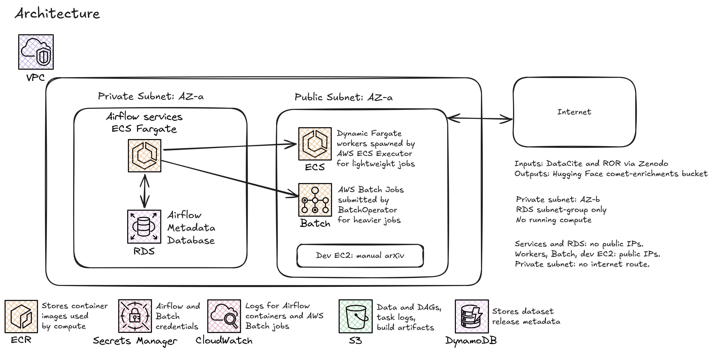
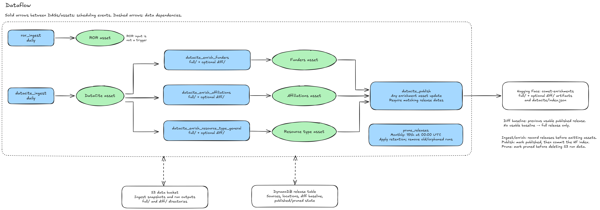
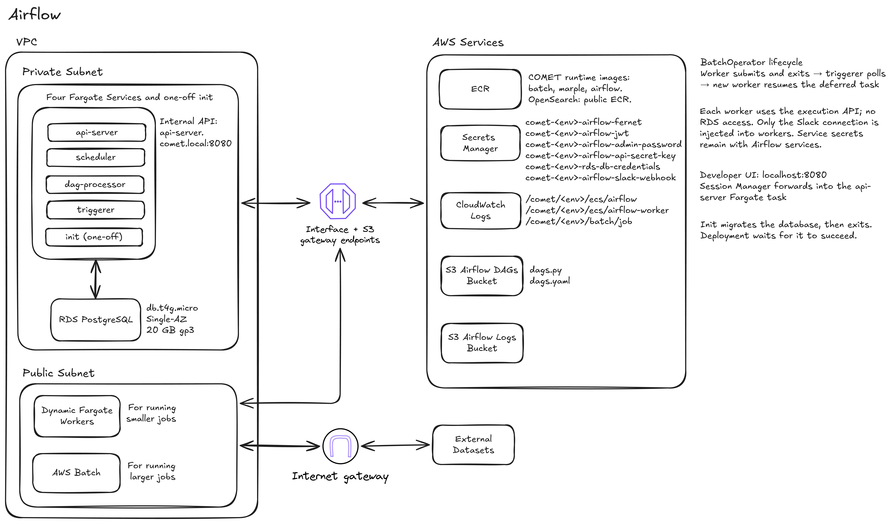
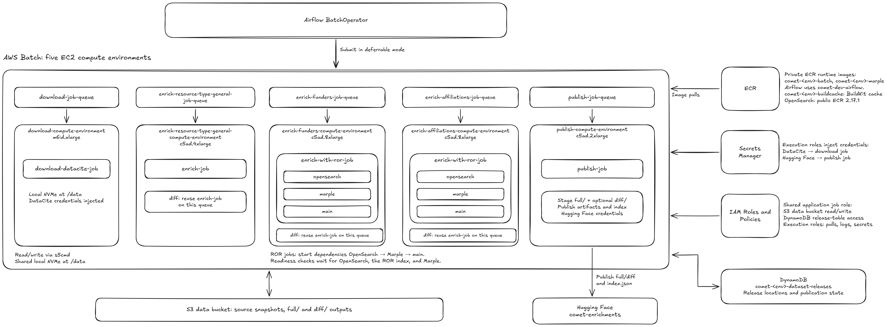
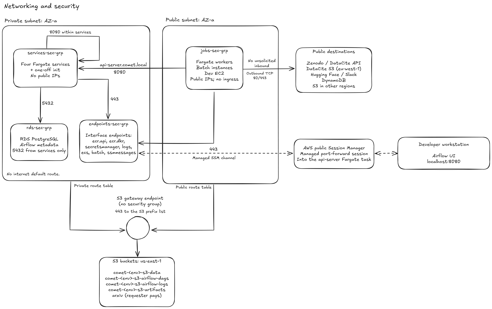

# Architecture

COMET runs data processing workflows that download and enrich external scholarly datasets such as [DataCite](https://datacite.org), [ROR](https://ror.org), and [arXiv](https://arxiv.org). [Apache Airflow 3](https://airflow.apache.org) provides the workflow orchestration layer, while ECS Fargate and AWS Batch provide the compute for processing tasks.

COMET-managed infrastructure is defined in CloudFormation and deployed with [Sceptre](https://docs.sceptre-project.org/). The shared network, template bucket, authorized GitHub connection, and some secrets are external prerequisites; deployment settings and enrichment configuration are supplied separately. See [AWS account prerequisites](setup.md#aws-account-prerequisites) and [setup.md](setup.md) for deployment instructions.

Compute and the metadata database run in a single availability zone. The persistent Airflow services and database use a private subnet; ephemeral Fargate workers, Batch instances, and the dev instance use a public subnet to download external data.

## Data pipelines

Two ingest DAGs run daily. Each checks the upstream source for a release newer than the last one recorded in the `comet-<env>-dataset-releases` DynamoDB table, downloads it to `s3://<data-bucket>/{dag_id}/{run_id}/`, records the release, and publishes an Airflow Asset. The asset is updated after ingestion completes, not when discovery finds a release. The three DataCite enrichment DAGs are scheduled on the DataCite asset, so they run whenever a new DataCite snapshot is ingested. Funders and affiliations use a selected ROR release as input; ROR ingestion alone does not schedule them.

Each enrichment DAG writes a full release to `s3://<data-bucket>/{dag_id}/{run_id}/full/` and a diff against the latest usable earlier published release to `{dag_id}/{run_id}/diff/`. When no suitable earlier release exists, only the full release is produced. Enrichment or diff failures prevent the run from being recorded and published.

Release records track these locations and the diff's baseline. Publishing checks that the baseline is still the newest published release. Pruning removes the full and diff outputs together.

A published release can be replaced using the `replace_published` trigger parameter. The new run is marked for publication and overwrites the existing export folders. See [Re-running a published release](setup.md#re-running-a-published-release).

Publishing DAGs run after their enrichment assets are updated. When the selected enrichments have the same release date, the DAG copies their `full/` and any `diff/` directories to a Hugging Face S3-compatible bucket, records them as published, and uploads the release index. See [enrichment-data.md](enrichment-data.md) for how to access the published files.

The `prune_releases` DAG runs monthly. It retains the configured number of source and published enrichment releases. Unpublished enrichment outputs remain until a newer publication supersedes them.

Untracked prefixes become eligible after the configured grace period. Release records are marked as pruned before their S3 data is removed so retries cannot resolve missing run data.

Heavier processing runs as AWS Batch jobs. The general pattern is to store input and output data in S3: each job downloads the data it needs to local NVMe disk, processes it, uploads the results back to S3, and exits. [s5cmd](https://github.com/peak/s5cmd) is used for the transfers because it is significantly faster than the AWS CLI for large transfers and workloads involving many files. Each job writes to an S3 path that includes the Airflow run ID, and deletes anything already at that path before it starts, so jobs can be re-run safely and don't rely on local state or a specific instance.

Each DAG is created by a factory function in the `comet` package. The DAGs bucket holds a small `dags.py` entry point and a `dags.yaml` file with one entry per DAG instance; a new DAG is added by appending an entry to the YAML file (see [dags.md](dags.md)).

The factory code is installed in the Airflow image. The S3 DAG bundle downloads the entry point and YAML into a local directory, with a 60-second refresh interval configured for the API server, scheduler, and DAG processor. Workers download their own copy at startup and use a one-day refresh interval. These files must stay compatible with the deployed image.

Enrichment rules are maintained in `comet-enrich`, stored under the data bucket's `enrichment-configs/` prefix, and downloaded by Batch jobs at runtime. The infrastructure deployment does not manage these objects. Each enrichment record contains the DOI name of its enrichment project, such as `10.1234/example`, in `sourceId`; the DAG passes this value to `comet-enrich`.

The arXiv TeX extraction pipeline has not been moved to Airflow yet; it is run manually on the dev EC2 instance (see [arxiv-pipeline.md](arxiv-pipeline.md)). The dev instance is managed by an Auto Scaling Group that defaults to zero instances and is started on demand; a scheduled action shuts it down nightly (see [setup.md](setup.md)).

## Apache Airflow

The Airflow services run as four independent ECS Fargate services, each with its own task definition. ECS can restart a failed component separately. The metadata database coordinates orchestration, and the API server provides the Task Execution API used by workers; service networking also permits internal API traffic.

The four services and the init task:

* `init`: a one-off Fargate task that runs `airflow db migrate` and `airflow fab-db migrate`, and handles [Fernet key rotation](setup.md#rotating-the-fernet-key) when configured. A `before_launch` hook on the services stack waits for it to succeed before deploying the services.
* `api-server`: the UI and the Task Execution API that workers use.
* `scheduler`: triggers DAG runs and dispatches tasks.
* `dag-processor`: parses the DAG bundle from the DAGs bucket.
* `triggerer`: runs triggers while tasks are deferred; operators execute and resume in workers.

Current task sizing:

| Component | vCPU | Memory |
|-----------|------|--------|
| API server, scheduler, DAG processor (each) | 0.25 | 0.5 GiB |
| Triggerer | 0.25 | 1 GiB |
| Worker (default) | 1 | 2 GiB |

The scheduler uses the [AWS ECS Executor](https://airflow.apache.org/docs/apache-airflow-providers-amazon/stable/executors/ecs-executor.html) to run each Airflow task as a one-off Fargate task. Workers are not provisioned with database credentials, the Fernet key, or the execution-API signing key; they access connections, variables, and orchestration state through the Task Execution API. The Slack connection is an exception, injected as `AIRFLOW_CONN_SLACK_DEFAULT`.

Workers submit Batch jobs with `BatchOperator` in deferrable mode, then exit while the triggerer polls job status. Completion launches a worker to resume the operator, so no worker stays occupied for the Batch job's lifetime.

Slack notifications cover task failures, selected task-success/progress events, and deadlines measured from when a DAG run is queued. Deadline notifications launch a separate worker with `SyncCallback`.

The deployment also relies on several supporting AWS services:

* RDS PostgreSQL stores the Airflow metadata database.
* S3 stores the DAG bundle and task logs.
* Secrets Manager stores the Fernet key, database credentials, admin password, the JWT secret for the Task Execution API, and the API server session signing key.
* CloudWatch stores Airflow service, worker, and Batch container logs with 14-day retention. Airflow task logs are stored separately in S3 and expire after 365 days. See [Logs](setup.md#logs).

The UI uses the FAB authentication manager. Inbound traffic from the internet is blocked; `scripts/airflow-ui.sh` uses Session Manager to port-forward into the ECS Exec-enabled api-server task. See [Open the Airflow UI](setup.md#open-the-airflow-ui) for access and login instructions.

## AWS Batch

AWS Batch runs the heavier jobs on EC2 instance families selected for their CPU, memory, and fast local NVMe storage. Compute environments can scale to zero when idle.

There are five queues, each with its own compute environment and one allowed instance type:

| Queue / compute environment workload | Instance type |
|--------------------------------------|---------------|
| `download` | `m6id.xlarge` |
| `publish` | `c5ad.2xlarge` |
| `enrich-resource-type-general` | `c5ad.4xlarge` |
| `enrich-funders` | `c5ad.8xlarge` |
| `enrich-affiliations` | `c5ad.8xlarge` |

Job resource requests are sized so that one job nearly fills the instance to avoid contention. A launch template mounts the instance NVMe disks at `/data` (RAID0 when there are two disks).

The queues use four reusable job definitions:

* `download-datacite`: copies the DataCite snapshot to S3. It has its own execution role because ECS injects the DataCite credentials from Secrets Manager.
* `enrich`: generic single-container CPU enrichment, such as resource type reclassification.
* `enrich-with-ror`: a [single-node multi-container job](https://docs.aws.amazon.com/batch/latest/userguide/create-job-definition-single-node-multi-container.html) used by the funders and affiliations enrichments. Container `START` dependencies set the launch order. Application checks then make [Marple](https://gitlab.com/crossref/labs/marple) wait for OpenSearch readiness and load the selected ROR release before serving requests; the main container waits for Marple's health endpoint before running enrichment.
* `publish`: copies enrichment releases from the data bucket to the Hugging Face bucket. It has its own execution role because ECS injects the Hugging Face credentials from Secrets Manager.

When an Airflow task starts a Batch job, the `BatchOperator` supplies the command and CPU and memory requirements for that run. This lets several tasks reuse the same job definitions. It also tags each job with its environment and service so it can be identified with the rest of the deployment.

Single-container Batch output is also copied into Airflow task logs, but not multi-container yet.

## Networking and security

The VPC has a public subnet with an internet gateway for the Airflow Fargate jobs and the AWS Batch jobs. The VPC also has a private subnet for the Airflow services and the RDS metadata database. The private subnet has no route to the internet: the services reach the AWS APIs they need through VPC interface endpoints, and reach S3 through the free gateway endpoint. Whilst the Airflow services and the RDS metadata database have public access disabled in CloudFormation, the private subnet acts as a second layer of defense.  Everything is deployed into a single availability zone. A second private subnet in another AZ exists only to satisfy the RDS two-AZ requirement; nothing runs in it.

There are four security groups, one for each group of resources. None of them accept traffic from outside the VPC; the UI and shell access go through SSM, which only needs outbound access.

* `services` contains the four Airflow Fargate services and the one-off init task. Airflow's database credentials, Fernet key, JWT secret, API session signing key, and admin password are injected into tasks in this group as required. The only inbound rules are port 8080 from `jobs` for the Task Execution API, and port 8080 from itself so the components can reach the api-server. These tasks have no public IPs; they sit in the private subnet and reach AWS only through the VPC endpoints.
* `jobs` contains the Fargate workers, Batch instances, and the dev instance, and has no inbound rules. They all have public IPs because they download external data.
* `endpoints` accepts 443 from `services` and `jobs`.
* `rds` accepts 5432 from `services` only. Workers and Batch jobs cannot connect to the database. Airflow workers use the execution API for orchestration state; Batch applications access S3 and, where needed, DynamoDB directly.

Cloud Map registers the API server under the private hostname `api-server.comet.local`. Workers connect to `http://api-server.comet.local:8080/execution/` within the VPC.

The seven interface endpoints are ECR API (`ecr.api`), ECR Docker (`ecr.dkr`), Secrets Manager, CloudWatch Logs, ECS (scheduler worker launches), Batch (triggerer status polling), and SSM messages (ECS Exec and UI port-forwarding). S3 uses a separate free gateway endpoint, also used for ECR image layers. The workstation connects through AWS's public Session Manager service; it does not directly access the private VPC endpoint.

Task roles grant AWS permissions to application code. Execution roles grant the ECS agent permissions for image pulls, logs, and secret injection. Airflow services and workers have separate task and execution roles. Batch application containers share one job role with access to the data bucket and release table; download and publish use separate execution roles to inject their respective credentials.

## Container images

| Image           | Built from / registry | Runs on                                        |
|-----------------|-----------------------|------------------------------------------------|
| `comet-batch`   | `Dockerfile.batch`   | AWS Batch jobs and the dev EC2 arXiv pipeline   |
| `comet-marple`  | `Dockerfile.marple`  | The Marple container in enrich-with-ror jobs    |
| `comet-airflow` | `Dockerfile.airflow` | Airflow services and Fargate workers            |
| OpenSearch | `public.ecr.aws/opensearchproject/opensearch:2.17.1` | The OpenSearch container in enrich-with-ror jobs |

The three COMET images are built for `linux/amd64` (x86-64), stored in ECR, selected by an image tag in SSM, and resolved to sha256 digests at deploy time. See [Image builds and releases](setup.md#image-builds-and-releases) for build, tagging, and deployment procedures.

## Deployment permissions

COMET uses separate roles for CodeBuild and CloudFormation. CodeBuild can create, update, and delete only the environment's `comet-<env>-*` stacks and must ask CloudFormation to use the deployment service role. It can also read the external stack outputs used by the COMET configuration and run the Airflow database migration task. CloudFormation has broad permissions to provision the services used by the environment, but any IAM role it creates must have the COMET permissions boundary. It cannot create IAM users or access keys or change the roles and policies created by `make bootstrap`.

The permissions boundary is attached to every IAM role created by the environment stacks, including roles for services, jobs, builds, and monitoring. An action is allowed only when both the role's own policy and the boundary allow it. The boundary permits access to the environment's resources and the AWS read and monitoring calls needed to run them, including calls made by Systems Manager and ECS agents. It prevents those roles from creating or editing IAM roles and policies.

`make bootstrap` creates the boundary and the two deployment roles separately from the environment stacks. CloudFormation assigns their names, while their fixed IAM paths keep the ARN prefixes predictable when a role is replaced. See [Deployment permissions](setup.md#deployment-permissions) for the setup procedure.

## Monitoring and cost alerts

Alarms and budgets notify operators; they do not enforce spending caps or stop work.

### Alarms

* CloudWatch Logs: alarm when log ingestion exceeds the per-five-minute byte threshold in at least two of the last four periods.
* S3: alarm when combined storage across the four project buckets exceeds the configured threshold.
* AWS Config: alarm when the number of configuration items recorded in an hour exceeds the threshold. This is a regional count of recorded items across all resource types, not a count of distinct COMET resources.
* RDS: forward low-storage and configuration-change events to the monitoring SNS topic.
* EC2 and Fargate worker tasks:
  * Alarm when tasks exceeds the age threshold for two consecutive five-minute periods.
  * Alarm when task launches in the previous ten minutes exceed the threshold for two consecutive five-minute periods.
* Airflow ECS services:
  * Alarm when fewer service tasks are running than expected for two consecutive five-minute periods.
  * Alarm when one or more service tasks report an essential-container failure for two consecutive five-minute periods.
* AWS Lambda: alarm when the monitoring function is invoked more than twice in a five-minute period.

### Cost budgets

* Track monthly amortized costs, alerting at 75%, 90%, and 100% of actual spend and 100% of forecast spend.
* Track monthly internet egress, alerting at 50%, 75%, and 100% of actual usage and 100% of forecast usage.
* Track monthly AWS Config and CloudWatch spend in the deployment region, alerting at 50%, 75%, and 100% of actual spend and 100% of forecast spend.
* Track all monthly spend in the deployment region, alerting at 100% of actual spend and 100% of forecast spend.

### Cost allocation

`Subservice` groups COMET costs into:

* `platform`: Airflow services and supporting infrastructure, including service logs.
* `jobs`: Fargate workers, Batch compute, job data, and Airflow task logs.
* `build`: image builds, deployment, container repositories, and build artifacts.
* `dev-instance`: the development EC2 instance.

Endpoint data processing counts toward `platform`, including traffic caused by jobs. Some charges have no `Subservice` allocation.

### Notifications

Monitoring notifications are delivered to every address in the `alert_emails` list in `vars-dev.yaml`; at least one address is required. CloudWatch alarms, RDS events, and AWS Budgets publish to the monitoring SNS topic, which forwards notifications to those addresses.
